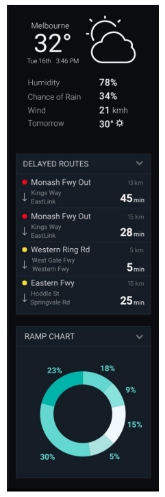

# Transmax Take Home

*Deployed at:* <https://transmax-takehome.vercel.app/>

## Overview

Develop a sidebar for a situational awareness dashboard based on the provided mock. The sidebar should be written in React (using create-react-app to  bootstrap the application); all other choices are up to the developer (e.g. choice of UI framework). All the data in the mock can be hardcoded (e.g. weather, delayed routes) except the ramp chart, which should be populated using the provided API.

Ramps are updated every half a second, and we want the ramp chart to update every time new data is received. Since the chart is frequently
updating, we expect it to be done in a performant and visually appealing way.
We’d also like to see one non-trivial unit test for a part of the sidebar (for example the weather widget or the delayed routes list). Create-react-app has a unit testing framework already setup, so just focus on writing a meaningful unit test for one of the widgets.

Finally, think of this like a MasterChef challenge: get as close as you can with the time and tools you have available, but if you don’t complete it perfectly, we still want to see how close you got and what your code looks like. We are looking for the following:

- Skills in CSS
- Skills in JavaScript or TypeScript, and React
- Ability to closely follow provided mock
- Skills in writing unit tests

Other things to note include:

1. Google’s font “Roboto” should be used
2. The ramp chart shows the percentage of ramps running a particular algorithm

### TLDR

1. Create a React app using create-react-app
2. Use the provided mock to create a sidebar
3. Use the provided API to populate the ramp chart
4. Write a unit test for one of the widgets

#### Mock



#### Ramp Data API

```javascript
/**

* A mock api to get ramp information
*
* This returns a list of ramps and their current
* running algorithm, for use in the ramp chart
*/
function getRampAlgorithms(onUpdate) {
  const count = 50;
  setInterval(() => {
    const ramps = [];
    for (let i = 0; i < count; i++) {
      ramps.push({
        id: `ramp-${i}`,
        algorithm: [
          'Algorithm 1',
          'Algorithm 2',
          'Algorithm 3',
          'Algorithm 4',
          'Algorithm 5',
        ][Math.floor(Math.random() * 5)],
      });
    }
    onUpdate(ramps);
  }, 500);
}
export default getRampAlgorithms;

/*
Example:
import getRampAlgorithms from "./api";
 getRampAlgorithms((ramps) => {
 console.log(ramps);
});
*/
```

## Thoughts

### create-react-app

this was painful, initially used vite to build this out just to get it where i wanted and then switched to create-react-app. So i didn't have to deal with all the quirks and legacy.

I figured this was to demonstrate I can handle legacy code and work with it. But I would be remiss if I didn't mention that starting any new project with create-react-app is a bad idea.

Having sad that I also have a version of this code bootstrapped with vite and I can share that if you want to see it.

### The Ramp Chart

I was not able to hack chartjs without going into a deeper dive than I thought was acceptable for this task so I omitted the labels for the individual pie sections.

I used a throttle technique to wrap the update function so that the high frequency could handled in a more performant way.

There was not a clear indication of how important the real time update aspect was, other solutions might have been to add a refresh button and only update on demand.
